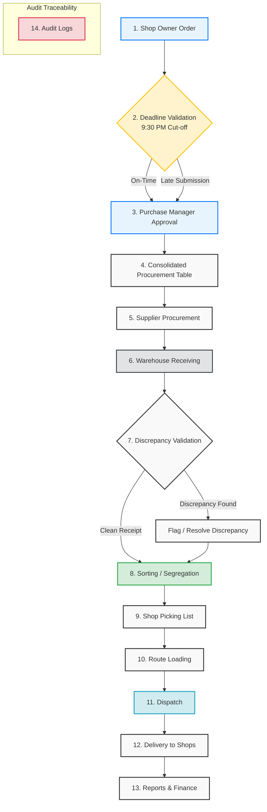

# Current Business Flow — Centralized Procurement & Distribution

Green Leaf ERP operates as a **centralized procurement and distribution system** for multiple retail shops. This is NOT a classic customer-sales ERP; instead, the system is designed to fulfill daily inventory demand requested internally by individual shop owners.

---

## 📊 Operational Flow Diagram

---

## ⚙️ Detailed Stage Definitions

### 1. Shop Owner Order
* **Actor**: Shop Owner
* **Responsibilities**: Log in daily and submit the itemized vegetable demand/requisition for their shop.
* **System Actions**: 
  - Save drafts.
  - Fetch active product catalogs.
  - Automatically associate order with the owner's assigned shop.
  - Lock the order snapshot upon submission.
* **Validations**: 
  - Only active shops can order.
  - Quantities must be greater than zero.
  - Single submission window per business date.
* **Exceptions**: 
  - Duplicate submission for the same date.
  - Invalid product SKU.

### 2. Deadline Validation
* **Actor**: System (Automated Engine)
* **Responsibilities**: Enforce the 9:30 PM cutoff for standard ordering.
* **System Actions**: 
  - Compare order submission timestamp against the 9:30 PM cut-off.
  - Flag submissions as `on_time` or `late`.
  - Lock on-time submissions and route late orders to the manager exception workflow.
* **Validations**: System timezone alignment vs local business timezone (`Asia/Kuala_Lumpur`).
* **Exceptions**: Network latency handling for borderline timestamp submissions.

### 3. Purchase Manager Approval
* **Actor**: Purchase Manager
* **Responsibilities**: Review incoming shop orders, especially late submissions, and approve, adjust, or reject them.
* **System Actions**: 
  - Transit order state.
  - Log manager comments, timestamp, and user ID in the approvals ledger.
* **Validations**: 
  - Manager must have appropriate authz scope.
  - Order state must be `Submitted` or `LateSubmission`.
* **Exceptions**: Rejection requires a mandatory comment explaining the operational hold.

### 4. Consolidated Procurement Table
* **Actor**: System (Automated Engine)
* **Responsibilities**: Group all approved shop demands for a business date into a single, unified view for buying.
* **System Actions**: 
  - Sum itemized demand quantities across all approved orders.
  - Exclude rejected or draft orders.
  - Generate a consolidated view showing total quantity needed per SKU.
* **Validations**: Consolidate only orders with `Approved` or `ManagerOverrideApproved` states.
* **Exceptions**: Missing active product mapping or mismatched units of measurement (UOM).

### 5. Supplier Procurement
* **Actor**: Purchase Manager / Purchasing Staff
* **Responsibilities**: Allocate consolidated quantities to specific suppliers and issue purchase orders.
* **System Actions**: 
  - Generate procurement batches.
  - Log supplier assignments and expected unit purchase prices.
* **Validations**: Selected suppliers must be active and mapped to target SKUs.
* **Exceptions**: Supplier stockouts (requires manager to allocate to alternative suppliers or adjust expectations).

### 6. Warehouse Receiving
* **Actor**: Warehouse Manager / Receiving Clerk
* **Responsibilities**: Physically count, weigh, and inspect goods arriving from suppliers.
* **System Actions**: 
  - Create warehouse receipts.
  - Log physical weights and condition status against procurement items.
* **Validations**: Receipt must reference an active, generated procurement batch.
* **Exceptions**: Damaged produce, unexpected supplier deliveries.

### 7. Discrepancy Validation
* **Actor**: Warehouse Manager & Purchase Manager
* **Responsibilities**: Identify and validate variances between ordered/procured quantities and received weights.
* **System Actions**: 
  - Calculate variance `(Received Qty - Procured Qty)`.
  - Automatically flag receipts containing variances beyond threshold (e.g., +/- 2%).
* **Validations**: Discrepancies must have reason codes assigned (e.g., Shrinkage, Transport Damage, Supplier Shortage).
* **Exceptions**: Massive variances trigger automated alerts to the Purchase Manager.

### 8. Sorting / Segregation
* **Actor**: Warehouse Team (Sorter)
* **Responsibilities**: Sort physical vegetables, grade their quality, and allocate the stock to fulfill shop-specific order quantities.
* **System Actions**: 
  - Update sorted stock inventory counts.
  - Allocate sorted quantities to approved shop order items.
* **Validations**: 
  - Allocated quantity cannot exceed received quantity.
  - Allocation must map to a valid shop order item.
* **Exceptions**: Under-received stock requires proportional allocation or priority-based sorting.

### 9. Shop Picking List
* **Actor**: Picker
* **Responsibilities**: Prepare individual shop crates based on the generated picking manifest.
* **System Actions**: 
  - Generate a prioritized picking route/manifest for the warehouse floor.
  - Update picked state.
* **Validations**: Items can only be picked from sorted, validated batches.
* **Exceptions**: Stock damaged/spoiled on the warehouse floor during picking (requires immediate inventory write-off and picking re-route).

### 10. Route Loading
* **Actor**: Warehouse Manager / Dispatcher
* **Responsibilities**: Stage picked shop crates and load them onto assigned delivery vehicles.
* **System Actions**: 
  - Link shop orders to a route dispatch manifest.
  - Assign vehicle and driver.
* **Validations**: All crates for a shop must be marked `Picked` before loading.
* **Exceptions**: Vehicle capacity overload (requires route adjustment).

### 11. Dispatch
* **Actor**: Dispatcher
* **Responsibilities**: Hand over loaded vehicles to drivers and dispatch them.
* **System Actions**: 
  - Change dispatch state to `Dispatched`.
  - Log timestamp and out-of-gate odometer/fuel details.
* **Validations**: Driver and vehicle assignments must be complete.
* **Exceptions**: Vehicle breakdown at gate (requires manifest transfer).

### 12. Delivery
* **Actor**: Driver & Shop Representative
* **Responsibilities**: Unload crates at the physical shop and log shop-side acceptance.
* **System Actions**: 
  - Log delivery completion timestamp.
  - Capture discrepancies reported by the shop (e.g., transit spoilage).
* **Validations**: Delivered qty cannot exceed dispatched qty.
* **Exceptions**: Shop rejects certain items (requires immediate discrepancy logging and returns processing).

### 13. Reports & Finance
* **Actor**: Finance Team / Accountant
* **Responsibilities**: Audit daily performance, reconcile driver collection sheets, and compute gross margins.
* **System Actions**: 
  - Calculate daily COGS, procurement costs, wastage costs, and net margins.
* **Validations**: Reconciliations must tie to auditable ledger events.
* **Exceptions**: Unresolved discrepancies block daily ledger closure.

### 14. Audit Logs
* **Actor**: System (Automated)
* **Responsibilities**: Capture every user action, state change, and system event in an immutable log.
* **System Actions**: 
  - Append to `activity_log` and `audits` tables with payload changes and actor attribution.
* **Validations**: No user (including super-admin) can delete or modify audit entries.
* **Exceptions**: None.
