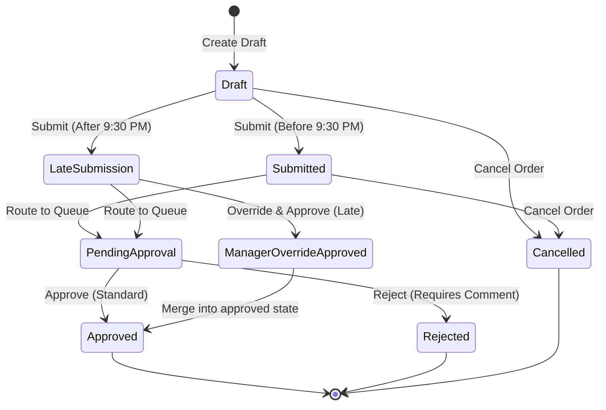
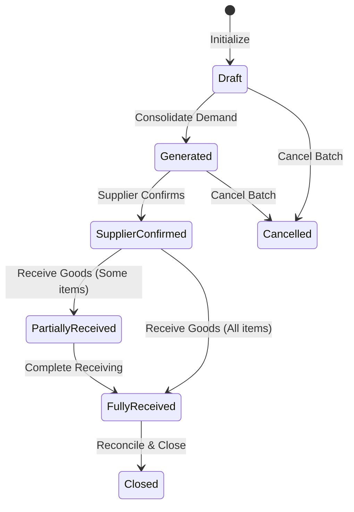
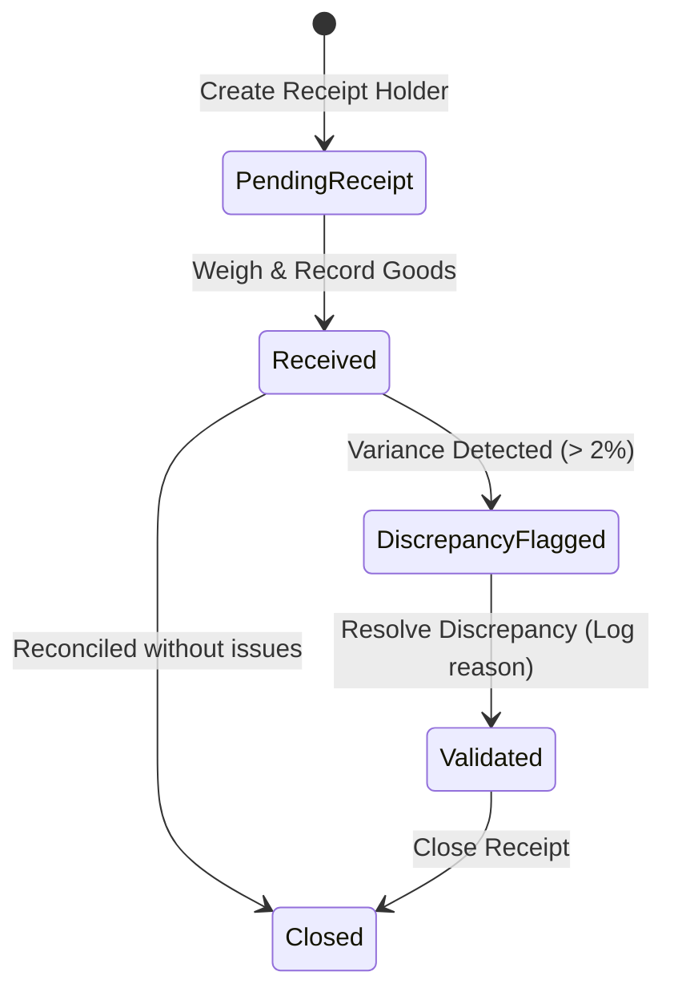
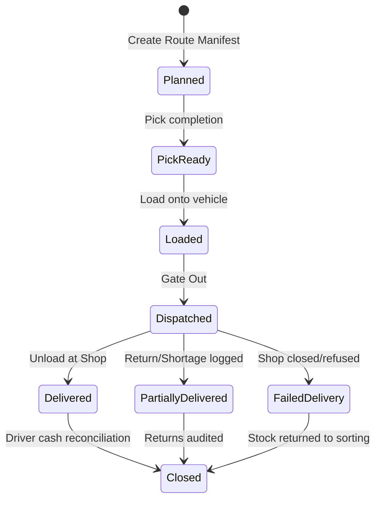

# State Machine Specification

This document defines the formal state transitions, events, triggers, and illegal transitions for the operational entities of Green Leaf ERP. 

---

## 🛒 1. Shop Order State Machine

### 📋 Transition Details

| Source State | Event/Trigger | Target State | Validation Rules / Requirements |
|---|---|---|---|
| `Draft` | Shop Owner submits before 9:30 PM | `Submitted` | Order items count $\ge 1$, quantities positive. |
| `Draft` | Shop Owner submits after 9:30 PM | `LateSubmission` | Automatically tagged by Deadline Engine. |
| `Submitted` | System route | `PendingApproval` | Placed in standard Purchase Manager queue. |
| `LateSubmission` | System route | `PendingApproval` | Placed in Purchase Manager exception queue. |
| `PendingApproval` | Purchase Manager approves | `Approved` | Manager role validation. |
| `PendingApproval` | Purchase Manager rejects | `Rejected` | Rejection comment is mandatory. |
| `LateSubmission` | Purchase Manager overrides | `ManagerOverrideApproved` | Custom override reason is logged in approvals. |
| `ManagerOverrideApproved`| System merge | `Approved` | Merged into the active consolidation pool. |
| `Draft` | Shop Owner cancels | `Cancelled` | Mark as administratively cancelled. |
| `Submitted` | Admin cancels | `Cancelled` | Allowed prior to approval processing. |

### 🚫 Illegal Transitions
- `Approved` $\rightarrow$ `Draft` (Prevents shops from changing quantities after buying has started)
- `Rejected` $\rightarrow$ `Approved` (Must go back to `Draft` and be resubmitted as a new transaction)
- `Cancelled` $\rightarrow$ `Approved`
- `Draft` $\rightarrow$ `Approved` (Bypasses approval workflow)

---

## 📦 2. Procurement Batch State Machine

### 📋 Transition Details
- **Draft $\rightarrow$ Generated**: Occurs when approved shop orders are consolidated.
- **Generated $\rightarrow$ SupplierConfirmed**: Triggered when the supplier acknowledges availability and price.
- **SupplierConfirmed $\rightarrow$ PartiallyReceived**: Goods arrive at the warehouse but with quantity/item shortages.
- **SupplierConfirmed $\rightarrow$ FullyReceived**: All ordered quantities match the received counts.
- **FullyReceived/PartiallyReceived $\rightarrow$ Closed**: Daily reconciliation complete.

### 🚫 Illegal Transitions
- `Closed` $\rightarrow$ `Generated`
- `Cancelled` $\rightarrow$ `Closed`

---

## 📥 3. Warehouse Receipt State Machine

---

## 🚚 4. Dispatch State Machine

