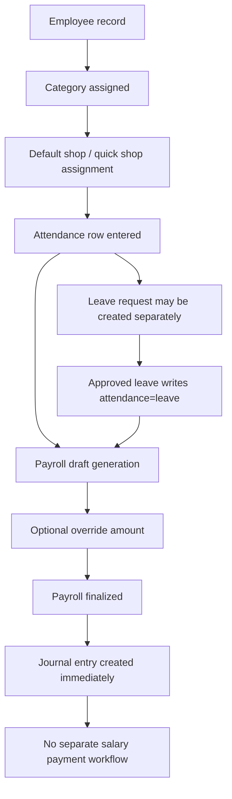

# Staff Payroll Workflow Audit

Date: 2026-07-10
Repository: `/Users/niyas/Sites/green-leaf-erp`
Scope: Existing Staff Management, Attendance, Leave, Payroll, and accounting touchpoints only. No behavior was changed during this audit.

## Audit Summary

The current HR/payroll implementation is a first-pass operational module with working CRUD, attendance entry, leave review, payroll draft generation, payroll override, payroll finalization, and payroll export.

It is not yet a complete staff/payroll system.

The strongest current capability is category-based monthly payroll calculation from attendance. The weakest areas are annual leave management, salary payment lifecycle, override auditability, and accounting separation between payroll accrual and actual salary payment.

The highest-risk current behavior is that payroll uses attendance rows directly, including `leave` rows created before leave approval, while finalization immediately posts a bank-credit journal entry even though no salary payment record exists.

## Workflow Overview

Current implemented flow:

```text
Employee creation
-> Category and location assignment
-> Attendance
-> Leave request and approval
-> Leave balance
-> Payroll generation
-> Payroll review
-> Payroll finalisation
-> Salary payment
-> Accounting entry
```

Actual current flow in code:

```text
Employee creation/update
-> Employee category + default shop + optional quick shop assignments
-> Attendance row entry by HR or shop owner
-> Leave request created separately
-> Approved leave auto-creates attendance rows with status=leave
-> Payroll draft generated from attendance rows for active employees
-> Optional item-level override amount
-> Payroll finalisation creates accounting journal immediately
-> No separate salary payment workflow exists
```

## Primary Components

### Core models

- [app/Models/Employee.php](/Users/niyas/Sites/green-leaf-erp/app/Models/Employee.php)
- [app/Models/EmployeeCategory.php](/Users/niyas/Sites/green-leaf-erp/app/Models/EmployeeCategory.php)
- [app/Models/ShopEmployeeAssignment.php](/Users/niyas/Sites/green-leaf-erp/app/Models/ShopEmployeeAssignment.php)
- [app/Models/EmployeeAttendance.php](/Users/niyas/Sites/green-leaf-erp/app/Models/EmployeeAttendance.php)
- [app/Models/EmployeeLeaveRequest.php](/Users/niyas/Sites/green-leaf-erp/app/Models/EmployeeLeaveRequest.php)
- [app/Models/PayrollRun.php](/Users/niyas/Sites/green-leaf-erp/app/Models/PayrollRun.php)
- [app/Models/PayrollRunItem.php](/Users/niyas/Sites/green-leaf-erp/app/Models/PayrollRunItem.php)

### Main controllers/services

- [app/Http/Controllers/Web/Admin/StaffManagementController.php](/Users/niyas/Sites/green-leaf-erp/app/Http/Controllers/Web/Admin/StaffManagementController.php)
- [app/Http/Controllers/Web/ShopOwnerStaffController.php](/Users/niyas/Sites/green-leaf-erp/app/Http/Controllers/Web/ShopOwnerStaffController.php)
- [app/Services/HR/AttendanceService.php](/Users/niyas/Sites/green-leaf-erp/app/Services/HR/AttendanceService.php)
- [app/Services/HR/PayrollService.php](/Users/niyas/Sites/green-leaf-erp/app/Services/HR/PayrollService.php)
- [app/Services/HR/EmployeeSyncService.php](/Users/niyas/Sites/green-leaf-erp/app/Services/HR/EmployeeSyncService.php)
- [app/Services/HR/StaffDirectoryService.php](/Users/niyas/Sites/green-leaf-erp/app/Services/HR/StaffDirectoryService.php)

### Permission/policy surface

- [database/seeders/RolePermissionSeeder.php](/Users/niyas/Sites/green-leaf-erp/database/seeders/RolePermissionSeeder.php)
- [app/Policies/EmployeePolicy.php](/Users/niyas/Sites/green-leaf-erp/app/Policies/EmployeePolicy.php)
- [app/Policies/EmployeeAttendancePolicy.php](/Users/niyas/Sites/green-leaf-erp/app/Policies/EmployeeAttendancePolicy.php)
- [app/Policies/EmployeeLeaveRequestPolicy.php](/Users/niyas/Sites/green-leaf-erp/app/Policies/EmployeeLeaveRequestPolicy.php)
- [app/Policies/PayrollRunPolicy.php](/Users/niyas/Sites/green-leaf-erp/app/Policies/PayrollRunPolicy.php)
- [app/Support/StaffAccess.php](/Users/niyas/Sites/green-leaf-erp/app/Support/StaffAccess.php)

## Stage-by-Stage Audit

### 1. Employee creation

Implemented:
- HR/admin staff CRUD exists.
- User-to-employee sync exists for linked login users.

How it works:
- HR/admin creates employees via `admin/staff`.
- Linked users can be re-synced by [EmployeeSyncService](/Users/niyas/Sites/green-leaf-erp/app/Services/HR/EmployeeSyncService.php), which derives category from role and preserves custom salary if salary was manually changed.

Roles involved:
- `admin`
- `hr_manager`

Statuses used:
- `employment_status`: `active`, `inactive`

Database:
- `employees`
  - important fields: `employee_code`, `user_id`, `default_shop_id`, `employee_category_id`, `staff_area`, `employment_status`, `monthly_salary`, `is_user_linked`

Controllers/services/views:
- Controller: `StaffManagementController@store`, `@update`, `@updateEmploymentStatus`, `@syncLinkedUsers`
- Requests: `StoreEmployeeRequest`, `UpdateEmployeeRequest`, `UpdateEmployeeStatusRequest`
- Views: `resources/views/admin/staff/employees.blade.php`, `show.blade.php`

Validations:
- unique `employee_code`
- `staff_area` restricted to `office|shop`
- `employment_status` restricted to `active|inactive`
- referenced `user`, `shop`, `category` must exist

Permissions:
- `hr.employee.view`
- `hr.employee.create`
- `hr.employee.update`

Tests:
- employee CRUD, linked-role display, sync behavior, inactive exclusion in payroll
- one pagination test currently fails

Missing features:
- no employee document/contract structure
- no employment dates beyond `joined_on`
- no staff detail override audit log
- no salary history table

Conflicting/duplicate logic:
- linked user role mapping can overwrite category/staff area during re-sync
- staff area exists both on category and employee and can drift

Risk of change:
- high, because `EmployeeSyncService` can silently realign linked employees based on roles

### 2. Category and location assignment

Implemented:
- employee categories exist
- default shop exists on employee
- quick shop assignment list exists through `shop_employee_assignments`

How it works:
- category is assigned directly on employee
- `default_shop_id` marks primary shop
- extra shop inclusion for owner quick attendance uses `shop_employee_assignments`

Roles involved:
- `admin`
- `hr_manager`
- `shop` owner for quick-list assignment inside owned shops

Statuses used:
- category `is_active`

Database:
- `employee_categories`
  - `code`, `staff_area`, `default_monthly_salary`, `monthly_paid_leave_limit`, payroll weights
- `employees.default_shop_id`
- `shop_employee_assignments`
  - `shop_id`, `employee_id`, `assigned_by`

Controllers/services/views:
- category CRUD in `StaffManagementController@categoriesIndex`, `@storeCategory`, `@updateCategory`
- shop-owner assignment in `ShopOwnerStaffController@storeEmployeeAssignment`
- views: `categories.blade.php`, `employees.blade.php`, `shop-owner/staff/index.blade.php`

Validations:
- unique category `name` and `code`
- `staff_area` restricted to `office|shop`
- salary weights limited to `0..1`
- `monthly_paid_leave_limit` limited to `0..31`

Permissions:
- category management piggybacks on employee create/update permissions
- shop owner assignment relies on role/scope checks, not a dedicated policy

Tests:
- category page and category creation
- quick shop assignment tests

Missing features:
- no payroll settings versioning
- no category-effective-date logic
- no category-specific annual leave entitlement table

Conflicting/duplicate logic:
- location can be inferred from `default_shop_id`, `shop_employee_assignments`, and attendance `shop_id`

Risk of change:
- medium-high, because shop scoping currently depends on multiple location sources

### 3. Attendance

Implemented:
- HR can backfill attendance for any date
- shop owners can mark only today’s attendance for owned shops
- statuses supported: `present`, `half_day`, `absent`, `leave`

How it works:
- attendance is stored one row per employee per date
- admin updates via `AttendanceService::upsert(..., source='admin')`
- shop owner updates via `AttendanceService::upsert(..., source='owner')`

Roles involved:
- `admin`
- `hr_manager`
- `shop`

Statuses used:
- `present`
- `half_day`
- `absent`
- `leave`

Database:
- `employee_attendances`
  - `employee_id`, `attendance_date`, `status`, `shop_id`, `marked_by`, `marked_at`, `source`, `notes`
  - unique: `(employee_id, attendance_date)`

Controllers/services/views:
- `StaffManagementController@attendanceIndex`, `@storeAttendance`
- `ShopOwnerStaffController@storeAttendance`
- service: `AttendanceService`
- views: `attendance.blade.php`, `show.blade.php`, shop-owner staff page

Validations:
- status enum validation
- employee/shop existence
- shop owner restricted to current date and owned shops

Permissions:
- `hr.attendance.view`
- `hr.attendance.manage`
- `hr.attendance.mark-owned-shop`

Tests:
- attendance board filters
- admin backfill
- owner today-only restrictions
- owner scope restrictions

Missing features:
- no shift/calendar/holiday/weekend rules
- no biometric/import source
- no formal correction workflow
- no override audit trail

Conflicting/duplicate logic:
- absent can be stored explicitly, but payroll also treats missing rows as absent

Risk of change:
- high, because payroll is directly derived from these rows

### 4. Leave request and approval

Implemented:
- leave request submission exists for HR/admin and shop owners
- HR/admin can approve or reject
- approval auto-creates attendance rows with `status=leave`

How it works:
- owner-created leave request uses `submission_type='owner'` and `status='pending'`
- admin-created leave request uses `submission_type='admin'`
- approval loops date range and upserts daily attendance as `leave`

Roles involved:
- `admin`
- `hr_manager`
- `shop`

Statuses used:
- leave request: `pending`, `approved`, `rejected`
- attendance side effect: `leave`

Database:
- `employee_leave_requests`
  - `employee_id`, `submitted_by`, `submitted_for_shop_id`, `start_date`, `end_date`, `status`, `submission_type`, `reason`, `reviewed_by`, `reviewed_at`, `review_note`

Controllers/services/views:
- `StaffManagementController@leavesIndex`, `@storeLeave`, `@reviewLeave`
- `ShopOwnerStaffController@storeLeave`
- views: `leaves.blade.php`, employee profile, shop-owner staff page

Validations:
- date range validation
- reason required
- review status restricted to `approved|rejected`

Permissions:
- `hr.leave.view`
- `hr.leave.manage`
- `hr.leave.submit-owned-shop`

Tests:
- leave page rendering
- HR leave submit
- leave review auto-marks attendance
- shop owner leave submission

Missing features:
- no leave type master data
- no approval levels
- no cancellation/withdrawal
- no override audit trail

Conflicting/duplicate logic:
- shop owner marking attendance as `leave` immediately also creates a pending leave request
- rejected leave does not automatically clean up any pre-existing `leave` attendance row

Risk of change:
- very high, because leave approval and attendance state are coupled but not consistently sequenced

### 5. Leave balance

Implemented:
- only a monthly payroll cap exists through category field `monthly_paid_leave_limit`

How it works:
- `PayrollService::attendanceSummary()` counts attendance rows with `status='leave'`
- it treats up to `monthly_paid_leave_limit` days as paid leave and remainder as unpaid leave
- there is no persistent leave balance ledger

Roles involved:
- indirect only, during payroll generation

Statuses used:
- none beyond leave request and attendance statuses

Database:
- no leave balance table
- no annual allocation table
- no carry-forward table

Controllers/services/views:
- service only: `PayrollService`
- some employee/profile/category views display the monthly limit

Existing validations:
- numeric cap on category

Existing permissions:
- inherited from category/payroll access

Existing tests:
- payroll tests confirm monthly paid leave cap behavior
- June seed test confirms paid vs unpaid leave split

Missing features:
- category-wise leave entitlement by leave type
- annual allocation
- carry-forward
- carry-forward cap
- carry-forward expiry
- actual leave balance calculation

Conflicting/duplicate logic:
- “leave balance” is implied in UI copy, but no persisted balance exists

Risk of change:
- very high, because current payroll logic assumes a simple monthly cap and nothing else

### 6. Payroll generation

Implemented:
- draft payroll run generation by month
- one row per active employee
- item rule snapshot stored

How it works:
- `StorePayrollRunRequest` converts `payroll_month` into month start/end
- `PayrollService::generate()` upserts payroll run for that period
- existing journal entry for the run is deleted if present
- all run items are regenerated
- active employees only are included
- computed amount = `(monthly_salary / days_in_period) * payable_units`

Roles involved:
- `admin`
- `hr_manager`

Statuses used:
- payroll run: `draft`, `finalized`

Database:
- `payroll_runs`
  - `period_start`, `period_end`, `status`, `generated_by`, `finalized_by`, `journal_entry_id`, `gross_amount`, `net_amount`
- `payroll_run_items`
  - `employee_id`, `employee_category_id`, `base_salary`, `present_days`, `half_days`, `paid_leave_days`, `unpaid_leave_days`, `absent_days`, `payable_units`, `computed_amount`, `override_amount`, `final_amount`, `rule_snapshot`

Controllers/services/views:
- `StaffManagementController@payrollIndex`, `@storePayroll`
- service: `PayrollService`
- views: `payroll.blade.php`, `payroll-pdf.blade.php`

Validations:
- month format
- period end must be after/equal start

Permissions:
- `hr.payroll.view`
- `hr.payroll.process`

Tests:
- payroll generation
- inactive staff exclusion
- export tests

Missing features:
- no salary component breakdown
- no statutory deductions
- no bonus/deduction engine
- no salary advance recovery
- no working-day calendar

Conflicting/duplicate logic:
- pay is category-weight driven, but employee-level payroll rules do not exist
- missing attendance days become absent automatically for every calendar day in month

Risk of change:
- very high, because regeneration replaces all item rows

### 7. Payroll review

Implemented:
- item-level manual override amount
- draft view and export

How it works:
- while run is `draft`, HR can set `override_amount`
- final payable amount becomes `override_amount ?? computed_amount`
- run totals are recalculated

Roles involved:
- `admin`
- `hr_manager`

Statuses used:
- run must be `draft`

Database:
- `payroll_run_items.override_amount`
- `payroll_run_items.final_amount`

Controllers/services/views:
- `StaffManagementController@updatePayrollItem`
- `UpdatePayrollRunItemRequest`
- `PayrollService::updateOverride()`
- `payroll.blade.php`

Validations:
- override must be numeric and `>= 0`
- update blocked once run is finalized

Permissions:
- uses payroll process permission

Tests:
- override preserves computed amount and changes final/run totals

Missing features:
- no approval note
- no reviewer sign-off
- no override reason
- no audit trail with old/new value

Conflicting/duplicate logic:
- “review” is really direct mutation, not a controlled approval stage

Risk of change:
- high, because current override is a blind write with no traceability

### 8. Payroll finalisation

Implemented:
- finalize action
- finalized metadata
- journal entry creation

How it works:
- `PayrollService::finalize()` refreshes totals
- creates accounting journal when gross amount > 0
- marks run `finalized`

Roles involved:
- `admin`
- `hr_manager`

Statuses used:
- `draft`
- `finalized`

Database:
- `payroll_runs.status`
- `finalized_by`
- `finalized_at`
- `journal_entry_id`

Controllers/services/views:
- `StaffManagementController@finalizePayroll`
- `FinalizePayrollRunRequest`
- `PayrollService::finalize()`

Validations:
- only draft runs can be finalized

Permissions:
- payroll process permission

Tests:
- finalization creates journal
- account recreation fallback works

Missing features:
- no explicit review approval step before finalization
- no reopen/unfinalize/cancel flow
- no finalization lock reason/history

Conflicting/duplicate logic:
- finalization currently doubles as accounting posting and implied payment

Risk of change:
- very high, because finance impact is triggered here

### 9. Salary payment

Implemented:
- not implemented as a separate workflow

How it currently works:
- there is no salary payment table, controller, status, payment mode, payment date, or reconciliation process
- the system jumps from payroll finalization straight to journal creation

Roles involved:
- none as a distinct salary-payment role

Statuses used:
- none

Database:
- no salary payment tables found

Controllers/services/views/tests:
- none found

Missing features:
- salary payment voucher/record
- paid/partially paid/unpaid tracking
- bank/cash mode
- payment reference
- payment reversal/correction

Risk of change:
- high, because accounting currently assumes payment happened already

### 10. Accounting entry

Implemented:
- payroll finalization creates a journal entry

How it works:
- `PayrollService::recordPayrollExpense()` creates or reuses:
  - account `5700` Salaries Expense
  - account `1020` Bank Account
- journal posts:
  - debit salary expense
  - credit bank

Roles involved:
- `admin`
- `hr_manager`

Statuses used:
- tied to payroll `finalized`

Database:
- `payroll_runs.journal_entry_id`
- `journal_entries` and dependent lines

Controllers/services:
- `PayrollService`
- `App\Services\Finance\JournalService`

Tests:
- finalization creates journal entry
- missing account rows are recreated

Missing features:
- accrued payroll liability account
- separation of payroll accrual vs payment settlement
- salary-payment-to-accounting linkage

Conflicting logic:
- accounting entry is posted at finalization, not payment

Risk of change:
- very high, because current finance effect likely does not match the intended business event

## HR and Admin Permissions

Current permission set:

- Employee: `hr.employee.view`, `hr.employee.create`, `hr.employee.update`
- Attendance: `hr.attendance.view`, `hr.attendance.manage`, `hr.attendance.mark-owned-shop`
- Leave: `hr.leave.view`, `hr.leave.manage`, `hr.leave.submit-owned-shop`
- Payroll: `hr.payroll.view`, `hr.payroll.process`

Role mapping from [database/seeders/RolePermissionSeeder.php](/Users/niyas/Sites/green-leaf-erp/database/seeders/RolePermissionSeeder.php):

- `admin`: all permissions
- `hr_manager`: full HR module permissions
- `shop`: only owned-shop attendance marking and leave submission, plus non-HR operational permissions

Gap:
- no separate permission for HR override audit actions
- no distinction between payroll generate, payroll review override, payroll finalize, and salary payment

## Existing Payroll Settings

Implemented payroll settings live on `employee_categories`:

- `default_monthly_salary`
- `monthly_paid_leave_limit`
- `present_day_weight`
- `half_day_weight`
- `paid_leave_weight`
- `excess_leave_weight`
- `absent_day_weight`
- `is_active`

Current default seeded categories:
- `office`
- `direct-board`
- `other-shop`

Gap:
- these are payroll weights, not a complete payroll settings system

## Requirement Gap Table

| Requirement | Current state | Gap |
|---|---|---|
| Payroll settings by employee category | Partially implemented via `employee_categories` payroll weights | No versioning, no richer component model |
| Category-wise leave entitlement | Not implemented | Only monthly paid leave cap exists |
| Annual leave allocation | Not implemented | No annual ledger |
| Carry-forward unused leave | Not implemented | No year-end carry process |
| Max carry-forward limit | Not implemented | No carry-forward fields/rules |
| Carry-forward expiry | Not implemented | No expiry model |
| HR override of attendance/leave/payroll/staff | Functionally possible through direct edits and overrides | No dedicated override flow, no audit log |
| Override audit trail old/new/reason/user/time | Not implemented | Critical compliance gap |
| Payroll based on attendance and approved leave | Partially implemented, but unsafe | Payroll uses attendance rows even when leave is still pending |
| Payroll and salary payment accounting integration | Partially implemented, but conflated | Finalization posts bank credit without salary payment workflow |

## Missing Features

- Leave types
- Leave entitlement ledger
- Annual leave allocation job/process
- Carry-forward rules
- Carry-forward expiry rules
- Salary components
- Bonus processing
- Deduction processing
- Salary advance tracking and recovery
- Salary payment workflow
- Override audit trail
- Multi-step payroll approval

## Conflicting or Duplicate Logic

1. Leave can exist in two places:
   - `employee_leave_requests`
   - `employee_attendances.status='leave'`

2. Shop assignment can exist in three places:
   - `employees.default_shop_id`
   - `shop_employee_assignments`
   - `employee_attendances.shop_id`

3. Absence can be represented in two ways:
   - explicit attendance row `status='absent'`
   - missing attendance row, which payroll still counts as absent

4. Payroll finalization currently implies both:
   - payroll approval
   - salary payment accounting

## Critical Bugs

1. Pending leave can affect payroll before approval.
   - Shop owner can mark attendance as `leave`, which creates a pending leave request immediately.
   - Payroll counts `employee_attendances.status='leave'` without checking leave request approval.

2. Rejected leave may leave attendance in `leave` state.
   - Approval writes attendance rows.
   - Rejection has no cleanup or reconciliation logic.

3. Payroll treats every missing day in the selected month as absent.
   - No weekend/holiday/off-day calendar exists.
   - This can underpay staff if attendance is not fully backfilled.

4. Payroll finalization credits bank immediately.
   - There is no salary payment record.
   - Accounting is posted as if cash/bank already moved.

5. Manual payroll overrides are unaudited.
   - No reason, no old/new snapshot, no approver trail.

## Current Test Results

Executed exactly as requested:

```bash
php artisan optimize:clear
php artisan migrate:status
php artisan route:list --except-vendor
php artisan test --filter=Staff
php artisan test --filter=Employee
php artisan test --filter=Attendance
php artisan test --filter=Leave
php artisan test --filter=Payroll
php artisan test --filter=Salary
```

Results:

- `php artisan optimize:clear`: passed
- `php artisan migrate:status`: all migrations reported as ran
- `php artisan route:list --except-vendor`: 340 routes listed; staff/admin/shop-owner routes present
- `php artisan test --filter=Staff`: failed
  - 10 passed, 1 failed
  - failing test: `Tests\Feature\Admin\StaffManagementTest::test_employee_directory_paginates_with_twenty_records_per_page`
  - file: [tests/Feature/Admin/StaffManagementTest.php](/Users/niyas/Sites/green-leaf-erp/tests/Feature/Admin/StaffManagementTest.php)
- `php artisan test --filter=Employee`: passed
- `php artisan test --filter=Attendance`: passed
- `php artisan test --filter=Leave`: passed
- `php artisan test --filter=Payroll`: passed
- `php artisan test --filter=Salary`: passed

No failing tests were fixed as part of this audit.

## Missing Payroll Settings

The current category settings do not cover:

- payroll cycle definition
- working-day basis vs calendar-day basis
- weekend/holiday exclusion
- leave-type mapping to pay behavior
- overtime
- earning components
- deduction components
- employer/employee contribution settings
- advance recovery settings
- payment account selection
- accrual account selection
- category-specific approval rules

## Current Workflow Diagram



## Recommended Safe Implementation Order

1. Freeze current behavior with more focused tests around leave, payroll, and accounting coupling.
2. Introduce explicit override audit tables before enabling more HR override power.
3. Separate leave balance domain from payroll domain.
4. Add annual leave entitlement/allocation/carry-forward ledger.
5. Change payroll calculation to consume approved leave balance outcomes, not raw `leave` attendance alone.
6. Add salary components, deductions, bonuses, and advance recovery model.
7. Split payroll finalization from salary payment.
8. Replace bank-credit journal on finalization with payroll payable accrual.
9. Add salary payment workflow and payment-linked accounting settlement.
10. Only then add richer category-wise payroll settings and HR override UI.

## Questions That Need Confirmation From The Client

1. Should payroll be based on calendar days, working days, or scheduled shift days?
2. Should unmarked days default to absent, or should they remain unresolved until attendance is completed?
3. Are leave types required from day one, and do different leave types affect pay differently?
4. Should annual leave entitlement vary only by employee category, or also by tenure/service length?
5. Should carry-forward happen automatically at year end, or only after HR review?
6. Does payroll finalization mean “approved for payment” or “accounting accrual posted”?
7. Should salary payment support partial payments and multiple payment modes?
8. Should HR overrides require maker-checker approval for payroll-sensitive changes?
9. Which accounting event is required at payroll finalization: expense accrual to payable, or direct bank posting?
10. Should shop owners be allowed to create `leave` attendance before HR approval, or only submit leave requests?

